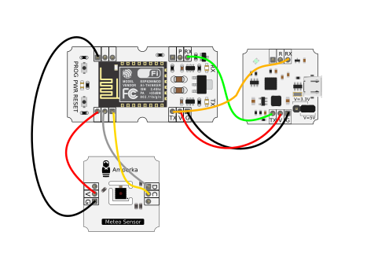
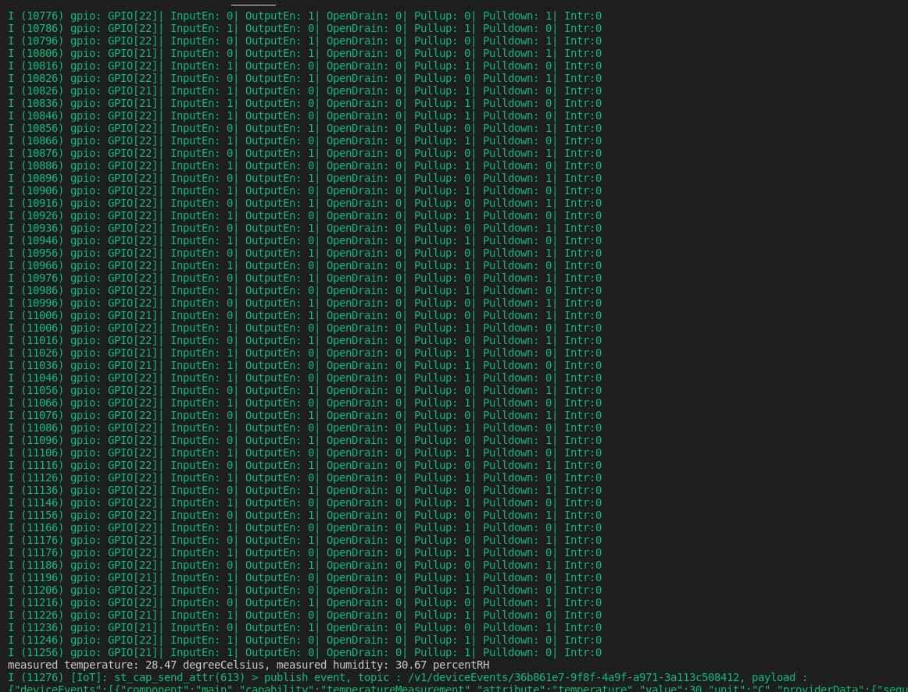
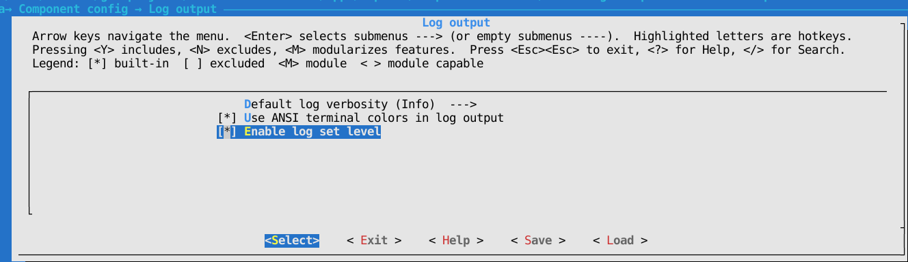

# Схема устройства

# Использование библитеки SHT
[Этот репозиторий](https://github.com/Sensirion/embedded-sht) содержит несколько библиотек для устройств на разных микросхемах. Наш [датчик](https://amperka.ru/product/troyka-meteo-sensor) на основе SHT31, поэтому библиотека нужна sht3x. Её рекомендуется скачать из раздела [Релизы](https://github.com/Sensirion/embedded-sht/releases) репозитория. 

Датчик работает по протоколу I2C, и для его использования в нашей плате esp должен быть контроллер I2C. В ESP8266 его нет, но можно его эмулировать. Библиотека SHT предлагает на выбор один из этих двух вариантов. В обоих случаях в файле *sensirion_xw_i2c_implementation.c* нужно имплементировать некоторые функции. Подробнее можно прочитать на [этой странице](https://github.com/Sensirion/embedded-common/tree/1ac7c72c895d230c6f1375865f3b7161ce6b665a) репозитория. 

В этом репозитории (smartthings-temperature-sensor) библиотека sht3x уже включена в проект как компонент и находится в директории *components/sht3x*. Функции в файле *sensirion_sw_i2c_implmentation.c* реализованы, и в них используются константы значений пинов GPIO_SDA и GPIO_SCL, которые определены в файле *main/device_control.h*. Без этих констант библиотека sht3x работать не будет. 
Также по правилам создания проектов с помощью ESP8266-RTOS-SDK каждый компонент должен содержать файл *component.mk*, а все заголовочные *.h файлы должны лежать в директории *include*, поэтому скачанная библиотека sht3x изменена под необходимое расположение файлов в проекте.

## Проблема бесконтрольных сообщений в логах

Если запускать сборку приложения с параметром monitor, можно в терминале просматривать сообщения/логи, которые приходят с платы. Но из-за датчика, который работает в эмулируемом режиме I2C, в терминал отправляется слишком много сообщений о переконфигурировании gpio пинов. Выглядит это как на картинке ниже. 

Решить проблему можно, понизив уровень логов для gpio с INFO на WARN. Для этого нужно:

1) войти в меню конфигурации, выполнив команду: `python build.py temperature_sensor menuconfig`

2) перейти в раздел 'Component config' -> 'Log output', и включить пункт 'Enable log set level'. Это позволит в коде программы задать новый уровень логов для gpio. 

3) в функции app_main в самом начале добавить строчку `esp_log_level_set("gpio", ESP_LOG_WARN);`, если её там нет.

4) пересобрать проект и прошить плату командой `python build.py temperature_sensor flash monitor` и убедиться в устранении проблемы.